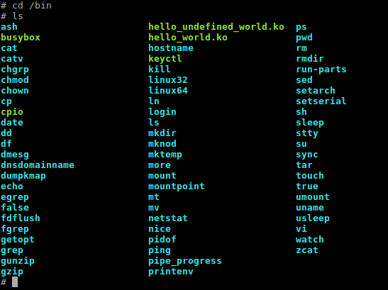

# kernel_panic_in_bootloader

## Let's be ready first. 
`i'm using Ubuntu 16.04 64-bit`; We need to install:

**1.** cross-toolchain for ARM (to build `ARM binaries` on x86 platform ([`cross-compilation`](https://en.wikipedia.org/wiki/Cross_compiler))):
```
$ sudo apt-get install gcc-arm-linux-gnueabi
```
**2.** [QEMU](https://wiki.qemu.org/Main_Page) for ARM architecture emulation:
```
$ sudo apt-get install qemu-system-arm
```
**3.** 'git' tool:
```
$ sudo apt-get install git
```
**4.** kernel build dependencies:
```
$ sudo apt-get install make bison flex libssl-dev
```

## task #1
> Build “Hello world” module, run it on QEMU. Try to dereference null pointer in the module and see results.
Add ability to change message by  trough module parameters (use MODULE_PARM_DESC() in your module).

First of all we need to download Linux Kernel sources and checkout on some release:
```
$ git clone git://git.kernel.org/pub/scm/linux/kernel/git/torvalds/linux.git
$ cd linux
$ git checkout -b v4.20 v4.20
```

and build Linux Kernel (to get `zImage`): 
```
$ make ARCH=arm CROSS_COMPILE=arm-linux-gnueabi- multi_v7_defconfig
$ make -j4 ARCH=arm CROSS_COMPILE=arm-linux-gnueabi- zImage
```
default zImage location is `arch/arm/boot/zImage`.

Now let's create our first driver. You must be inside `linux` root folder, then go to the folder with drivers and choose the most appropriate directory for storing your driver (in my case it's `$ cd drivers/misc && touch hello_world.c`).
``` C
/* hello_world.c */
#include <linux/init.h>
#include <linux/module.h>
#include <linux/kernel.h>

MODULE_LICENSE("GPL");
MODULE_DESCRIPTION("Hello module");
MODULE_AUTHOR("Kseniia Prytkova");

static int __init hello_init(void)
{
	printk("Hello world\n");
	return 0;
}

static void __exit hello_exit(void)
{
	printk("Goodbye, world\n");
}

module_init(hello_init);
module_exit(hello_exit);
```


Then we should describe the configuration interface for our new driver by edditing the `Kconfig` file (which is located in the same directory with our new driver).
```
$ pwd
/linux/drivers/misc
$ vim Kconfig
```
add something like:
```
config MISC_HELLO_WORLD
	tristate "Hello world module example"
	---help---
		To compile this driver as a module, choose M
		here: the module will be called "Hello world".
```
make some changes in the Makefile file based on the Kconfig setting (location is the same):
```
$ pwd
/linux/drivers/misc
$ vim Makefile
```
add a line:
```
obj-$(CONFIG_MISC_HELLO_WORLD)	+= hello_world.o
```
now run `$ make menuconfig` and you will see your new module:


press `<M>` and modularize your driver.

Next step is to compile our driver. We have 2 options: `1)` select the letter `<M>` after executing the command `$ make menuconfig` - **modularizing our feature** - this means that we will add our driver to the file system and then connect it with Linux Kernel (`$ make modules`). `2)` Choosing the letter `<Y>` - **includes our feature** - means we are adding our driver directly to the appropriate folder in `linux/drivers`, we are changing Linux Kernel physically, so we need to rebuild the entire Linux Kernel and get a new `zImage` (`$ make zImage`).

We are using 'module approach'. In practice, we must modularize our driver directly in the code (not in the graphical interface). And never forget about target architecture. So:
```
$ cd arch/arm
$ vim configs/multi_v7_defconfig
```
add this line:
```
CONFIG_MISC_HELLO_WORLD=m
```
go to root of Linux Kernel (/linux) and run:
```
$ make ARCH=arm CROSS_COMPILE=arm-linux-gnueabi- multi_v7_defconfig
$ grep -rn "CONFIG_MISC_HELLO_WORLD" arch/arm /* to check that our configs were saved */
$ make ARCH=arm CROSS_COMPILE=arm-linux-gnueabi- -j4 modules
```
in `linux/drivers/misc` will appear: `hello_world.ko`, `hello_world.mod.c`, `hello_world.mod.o`, `hello_world.o`. Good!

The last step is to connect rootfs.cpio archive with Linux Kernel. Download rootfs.cpio, in my case:


**IMPORTANT!** All manipulations with rootfs.cpio must be done **under root user**: 
```
$ sudo su
$ export ROOTFS_ARCHIVE=/path/to/rootfs.cpio
$ mkdir rootfs && cd rootfs
```
unpack your archive:
```
$ cpio -i < $ROOTFS_ARCHIVE
```
add here your modules or do all needed changes to the rootfs filesystem (now i'm in `rootfs/bin`):
```
$ cp ../../linux/drivers/misc/hello_world.ko .
$ chmod +xw hello_world.ko 
```
create rootfs archive again (**attention**: rewrites original file; create archive inside root directory in rootfs/ folder):
```
$ find . | cpio -o -H newc > $ROOTFS_ARCHIVE
```
**IMPORTANT!** Check (and change if needed) access rights for your rootfs.cpio (`$ chmod 777 rootfs.cpio`). Insufficient access rights can cause Kernel panic, while Linux Kernel will try to make friends with filesystem, for instance:


finish root mode (`$ exit`).
Let's check!
```
$ cd linux
$ qemu-system-arm -machine virt -kernel ./arch/arm/boot/zImage -initrd ../rootfs.cpio -nographic -m 512 --append "root=/dev/ram0 rw console=ttyAMA0,38400 console=ttyS0 mem=512M loglevel=9"
```
now we are inside QEMU:



go inside the corresponding directory into rootfs filesystem, where you left your driver.ko; try `insmod` and `rmmod`:
```
# cd /bin
# insmod hello_world.ko 
[  553.320697] Hello world
# rmmod hello_world.ko 
[  561.826473] Goodbye, world
```
here is the reaction of Linux Kernel on NULL pointer dereference inside module (exactly in my case):


The Linux Kernel can respond in several ways to inadequate events in the driver (and not only in driver): [**Decoding an oops/panic**](https://linux-kernel-labs.github.io/master/lectures/debugging.html)

`hello_parametric_world.ko` - it's the module to show ability to change message by trough module parameters; use `modinfo` to see the list of parameters:


and finaly, the example of giving parameters to our module:


#### Links
* [Bootlin](https://elixir.bootlin.com/linux/latest/source)
* [Linux Kernel Teaching](https://linux-kernel-labs.github.io/master/index.html)
* [The Kernel Newbie Corner: Everything You Wanted to Know About Module Parameters](https://www.linux.com/learn/kernel-newbie-corner-everything-you-wanted-know-about-module-parameters)