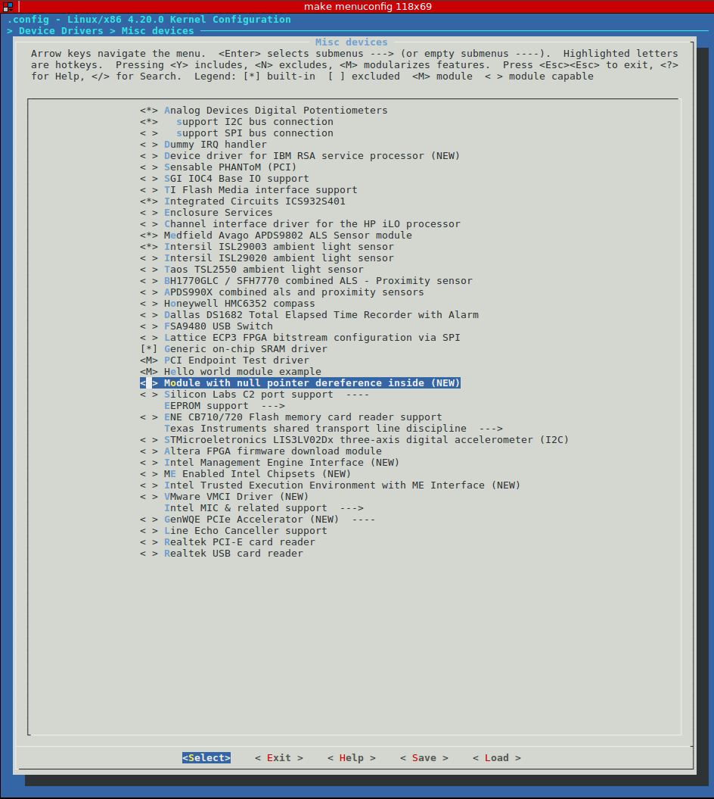

# kernel_panic_in_bootloader

## Let's be ready first. 
`i'm using Ubuntu 16.04 64-bit`; We need to install:

**1.** cross-toolchain for ARM (to build `ARM binaries` on x86 platform ([`cross-compilation`](https://en.wikipedia.org/wiki/Cross_compiler))):
```
$ sudo apt-get install gcc-arm-linux-gnueabi
```
**2.** [QEMU](https://wiki.qemu.org/Main_Page) for ARM architecture emulation:
```
$ sudo apt-get install qemu-system-arm
```
**3.** 'git' tool:
```
$ sudo apt-get install git
```
**4.** kernel build dependencies:
```
$ sudo apt-get install make bison flex libssl-dev
```

## task #1
> Build “Hello world” module, run it on QEMU. Try to dereference null pointer in the module and see results.
Add ability to change message by  trough module parameters (use MODULE_PARM_DESC() in your module).

First of all we need to download (to clone) Linux Kernel sources and checkout on some release:
```
$ git clone git://git.kernel.org/pub/scm/linux/kernel/git/torvalds/linux.git
$ cd linux
$ git checkout -b v4.20 v4.20
```

and build Linux Kernel (to get `zImage`): 
```
$ make ARCH=arm CROSS_COMPILE=arm-linux-gnueabi- multi_v7_defconfig
$ make -j4 ARCH=arm CROSS_COMPILE=arm-linux-gnueabi- zImage
```
default zImage location is `arch/arm/boot/zImage`.

Now let's create our first driver. You must be inside `linux` root folder, then go to the folder with drivers and choose the most appropriate directory for storing your driver (in my case it's `$ cd drivers/misc && touch hello_world.c`).
``` C
/* hello_world.c */
#include <linux/init.h>
#include <linux/module.h>
#include <linux/kernel.h>

MODULE_LICENSE("GPL");
MODULE_DESCRIPTION("Hello module");
MODULE_AUTHOR("Kseniia Prytkova");

static int __init hello_init(void)
{
	printk("Hello world\n");
	return 0;
}

static void __exit hello_exit(void)
{
	printk("Goodbye, world\n");
}

module_init(hello_init);
module_exit(hello_exit);
```

Then we should describe the configuration interface for our new driver by edditing the `Kconfig` file (which is located in the same directory with our new driver).
```
$ pwd
/linux/drivers/misc
$ vim Kconfig
```
add something like:
```
config MISC_HELLO_WORLD
	tristate "Hello world module example"
	---help---
		To compile this driver as a module, choose M
		here: the module will be called "Hello world".
```
make some changes in the Makefile file based on the Kconfig setting (location is the same):
```
$ pwd
/linux/drivers/misc
$ vim Makefile
```
add a line:
```
obj-$(CONFIG_MISC_HELLO_WORLD)	+= hello_world.o
```
now run `$ make menuconfig` and you will see your new module:

press <M> and modularize your driver.

Next step is to compile our driver. We have 2 options: `1)` select the letter `<M>` after executing the command `$ make menuconfig` - **modularizing our feature** - this means that we will add our driver to the file system and then connect it with Linux Kernel (`$ make modules`). `2)` Choosing the letter `<Y>` - **includes our feature** - means we are adding our driver directly to the appropriate folder in `linux/drivers`, we are changing Linux Kernel physically, so we need to rebuild the entire Linux Kernel and get a new `zImage` (`$ make zImage`).

Better to modularize driver:
We are using 'module approach', so:
```
$ make ARCH=arm CROSS_COMPILE=arm-linux-gnueabi- multi_v7_defconfig
$ make -j4 modules
```
(compilation in 4 threads, but it's up on you).

## task #2
> Add "uart-pl011" interrupt handling to the "Hello world" module.
It should print something when interrupt happens. This interrupt
should be shared between original amba-pl011.c and your module.
Hint: it can be done by using IRQF_SHARED flag (and original interrupt
request in amba-pl011.c should be also changed to shared).

## task #2.1
> Switch that interrupt handler to threaded interrupt version,
print current process ID for interrupted context in both parts of
handler (top and bottom halves). Hint: use ‘current->pid’ to print
current process id.